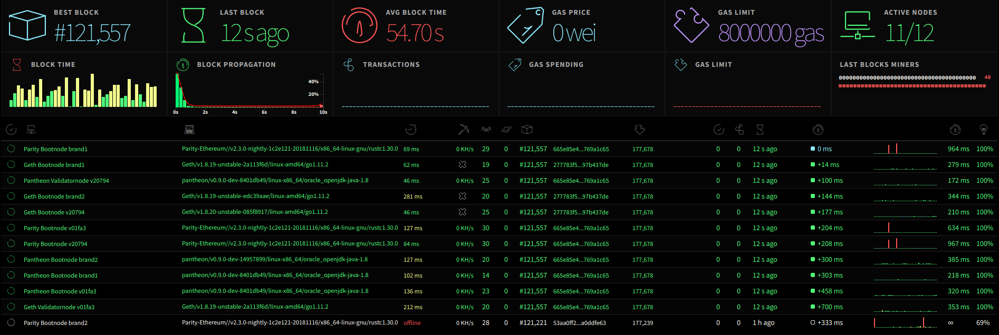

Meter Network Stats
===============================================

This is a visual interface for tracking Meter network status. It uses WebSockets to receive stats from running nodes and output them through an angular interface. It is the front-end implementation for [meter-stats-node](https://github.com/nextblu/meter-stats-node).

This service is hosted and maintained by Jelly.

## What to expect


* Dashboard: https://meterstats.jellypool.xyz/

#### Build
In order to build the static files you have to run grunt tasks which will generate dist directories containing the js and css files, fonts and images.

```bash
grunt poa
```

To build the static files for a network other than Ethereum copy and change src/js/defaultConfig.js and run the following command.

```bash
grunt poa --configPath="src/js/someOtherConfig.js"
```

## Huge thanks
This a fork of https://github.com/cubedro/eth-netstats but for Meter!